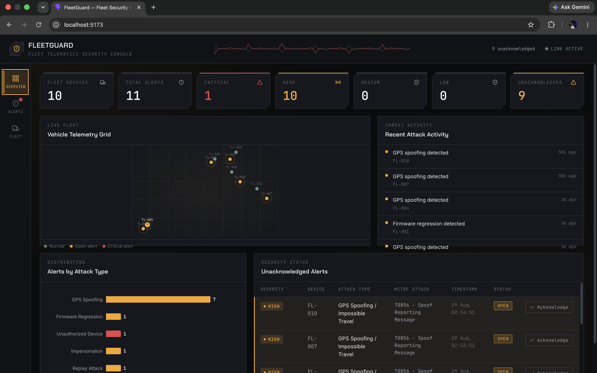
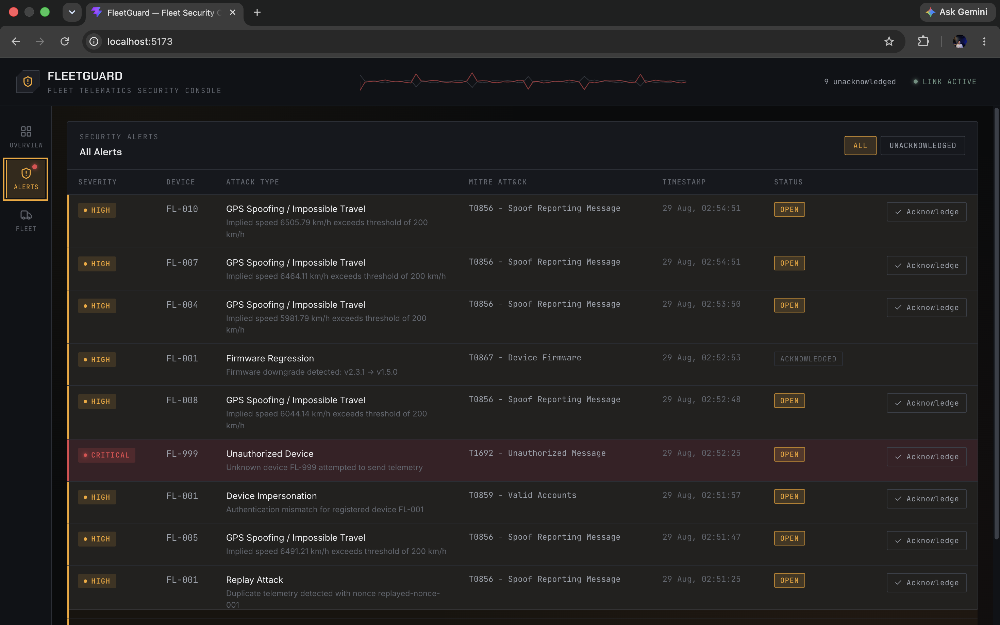
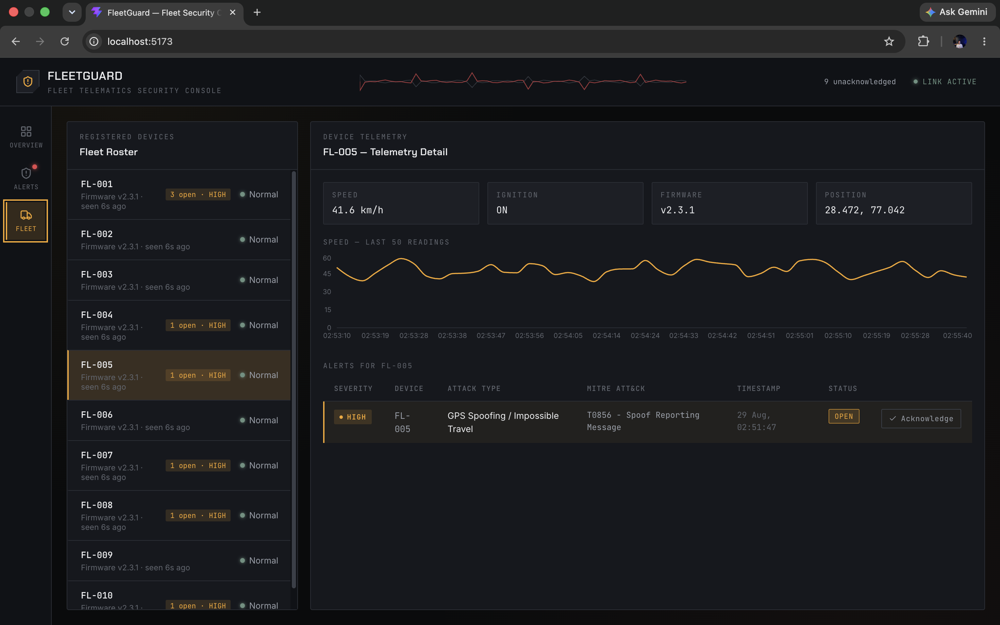
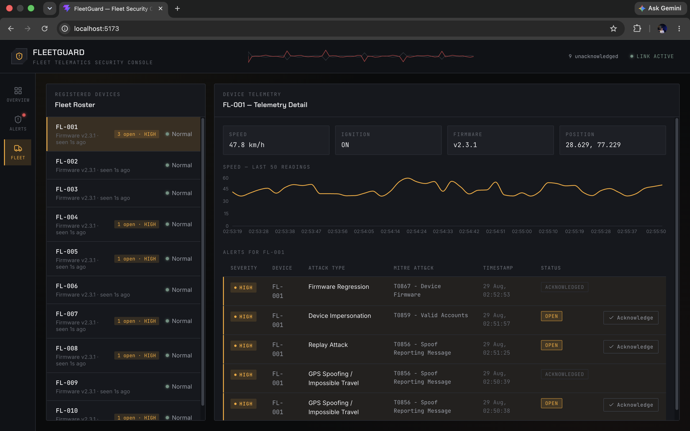

# FleetGuard

**IoT fleet telematics security platform.** FleetGuard ingests live vehicle
telemetry (GPS, speed, ignition state, firmware version) and detects five
real attack patterns in real time, surfaced through a SOC-style operations
console.



## What it does

Vehicles stream telemetry to a FastAPI backend. Every incoming packet is run
through four independent detection modules before it's accepted. Anything
suspicious generates a structured alert — severity, a MITRE ATT&CK mapping,
and human-readable details — which the dashboard displays and lets an
operator acknowledge.

| Attack | How it's detected | Severity | MITRE ATT&CK |
|---|---|---|---|
| GPS Spoofing / Impossible Travel | Haversine distance between two consecutive readings implies a speed > 200 km/h | High | T0856 – Spoof Reporting Message |
| Replay Attack | A telemetry packet arrives with a `device_id` + `nonce` + `timestamp` combination already seen | High | T0856 – Spoof Reporting Message |
| Device Impersonation | Registered device ID, but its `auth_token` doesn't match what was issued | High | T0859 – Valid Accounts |
| Unauthorized Device | Telemetry from a `device_id` that was never registered | Critical | T1692 – Unauthorized Message |
| Firmware Regression | Reported firmware version is semantically lower than the device's last known version | High | T0867 – Device Firmware |

## Architecture

```
Vehicles (simulator / attack injector)
        │  POST /api/telemetry/ingest
        ▼
FastAPI backend (SQLAlchemy + SQLite)
        │
        ├── Detection engine
        │     ├── impossible_travel.py   (GPS spoofing)
        │     ├── replay_detection.py    (duplicate nonce/timestamp)
        │     ├── identity_detection.py  (impersonation / unauthorized device)
        │     └── firmware_detection.py  (version downgrade)
        │
        ├── alert_service.py  → creates Alert rows with MITRE ATT&CK mapping
        │
        ▼
REST API (/api/stats, /api/alerts, /api/devices, /api/telemetry/{id})
        │
        ▼
React + Vite dashboard — polls the live API, no mock data anywhere
```

Everything the dashboard shows — device counts, alert severities, telemetry
positions, acknowledge state — comes directly from the backend's SQLite
database through the REST API above. Nothing in the frontend is hardcoded or
simulated client-side.

## Screenshots

| Overview | Alerts |
|---|---|
|  |  |

| Fleet Roster | Telemetry Detail |
|---|---|
|  |  |

## Project structure

```
FleetGuard/
├── backend/                  FastAPI application
│   ├── app/
│   │   ├── main.py           API routes
│   │   ├── models.py         SQLAlchemy models (Device, Telemetry, Alert)
│   │   ├── schemas.py        Pydantic request schemas
│   │   ├── database.py       SQLite engine/session
│   │   ├── detection/        The four detection modules
│   │   └── services/         Alert creation + MITRE mapping
│   └── requirements.txt
├── frontend/                 React + Vite dashboard
│   └── src/
│       ├── components/       Dashboard panels (FleetGrid, AlertsTable, ...)
│       ├── hooks/            Live polling hooks
│       ├── lib/api.js        API client
│       └── styles/           Design tokens + layout (graphite/amber theme)
├── simulator/                 Generates realistic live telemetry for 10 devices
├── attack-injector/           Fires each of the 5 attack scenarios on demand
└── docs/screenshots/          Dashboard screenshots used in this README
```

## Running it locally

```bash
git clone https://github.com/RaunitChatterjee/FleetGuard.git
cd FleetGuard
```

**1. Backend**

```bash
cd backend
python3 -m venv venv
source venv/bin/activate
pip install -r requirements.txt
uvicorn app.main:app --reload
```

Backend runs at `http://127.0.0.1:8000`. CORS is enabled so the dashboard
(a different origin/port) can call it directly.

**2. Register the fleet and start live telemetry**

```bash
cd simulator
python register_fleet.py       # registers FL-001 .. FL-010
python fleet_simulator.py      # streams live telemetry every few seconds
```

**3. Frontend**

```bash
cd frontend
npm install
npm run dev
```

Dashboard runs at `http://127.0.0.1:5173` by default (see `frontend/README.md`
for `VITE_API_BASE_URL` if pointing at a different backend host).

**4. Trigger an attack**

```bash
cd attack-injector
python attack_injector.py gps            # GPS spoofing / impossible travel
python attack_injector.py replay         # run twice — see note below
python attack_injector.py impersonation  # device impersonation
python attack_injector.py unauthorized   # unauthorized device
python attack_injector.py firmware       # firmware downgrade
```

> **Note on `replay`:** the injector sends a packet with a fixed nonce and
> timestamp. The first run just stores it — there's nothing to duplicate
> against yet. Run the command a second time to actually trigger the
> `replay_attack` alert.

Watch the alert land on the dashboard in real time, then acknowledge it from
either the Overview, Alerts, or Fleet tab — this calls the real
`PATCH /api/alerts/{id}/acknowledge` endpoint.

## API reference

| Method | Endpoint | Purpose |
|---|---|---|
| `POST` | `/api/devices/register` | Register a device (device ID, auth token, firmware version) |
| `POST` | `/api/telemetry/ingest` | Submit a telemetry packet; runs it through detection |
| `GET` | `/api/devices` | List registered devices |
| `GET` | `/api/telemetry/{device_id}` | Telemetry history for one device |
| `GET` | `/api/alerts` | All alerts, newest first |
| `PATCH` | `/api/alerts/{id}/acknowledge` | Mark an alert as acknowledged |
| `GET` | `/api/stats` | Fleet-wide counts (devices, alerts by severity, unacknowledged) |
| `GET` | `/health` | Health check |

## Known limitations

- `Device.status` is currently always `"normal"` — the backend doesn't yet
  compute a live per-device risk state, so the dashboard doesn't either.
- Detection is rule-based (thresholds, duplicate checks, semver comparison),
  not ML-based.
- Storage is SQLite, intended for local development/demo, not a
  production multi-tenant deployment.

## Tech stack

**Backend:** FastAPI, SQLAlchemy, SQLite, Pydantic
**Frontend:** React, Vite, recharts, lucide-react
**Detection:** rule-based, MITRE ATT&CK-for-ICS mapped
